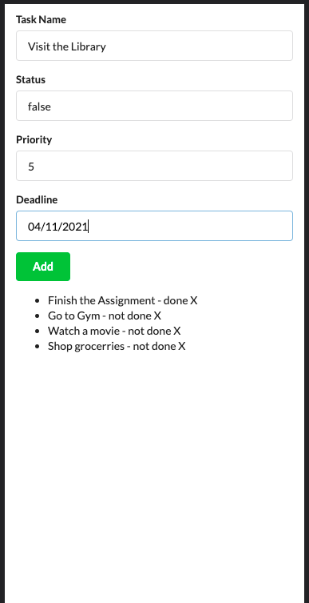

Front end is built using the React.js library

Setup and how to run:

1. Clone the project on your local machine.
2. Run npm install to install all the libraries
3. Run the app using: npm start

UI for the App

Find the Screenshot showing the UI for the app with the name UI_todo_app.png.

